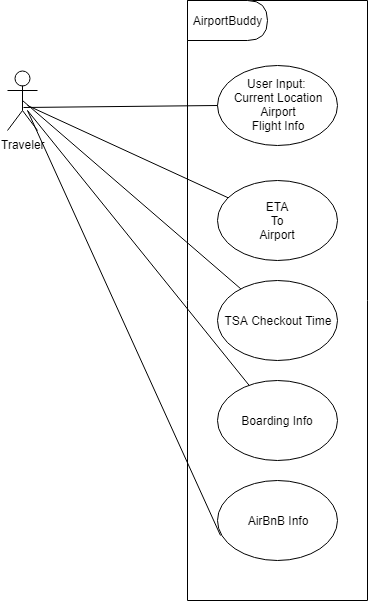

## Overall Project
  Airport Buddy is an open source android application on GitHub. An Android app that displays the user's flight imformation. It helps with
  some of the struggles when going to the airport. This app allows the user to check out their route to the airport and report back
  the estimated arrival time. Reports the time it will take to get through TSA checkpoint and flight information, such as time remaining
  until flight begins boarding. 
  
  

## Educational Goals
  Many educational goals can be met through this project. Test driven development can be met through this project which is 
  important when developing to make sure that features are working like they are suppose too. Object oriented design will be met
  through this project since we are going to have multiple classes such as adapters working together. Since this is an android
  app XML (extensible markup language) will be used. Working with databases will have to be done in this project. 
  
## Proposed Contribution
  I propose to add a feature that presents the user with local AirBnBs in the area of travel. 
  
## URL refernce:
    https://github.com/mmdahir/Airport-Buddy
    
## Required Resources
  - Java
  - Android Studios knowledge
  - Database knowledge
  - Android API(s)
  - mySQL
  - PHP (Database) 
